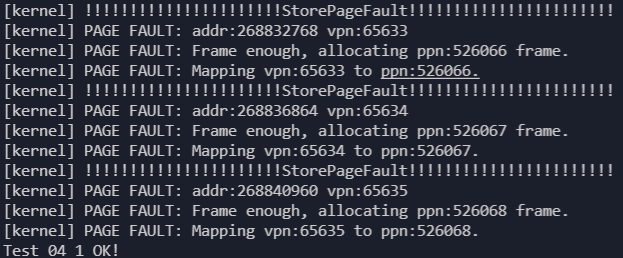
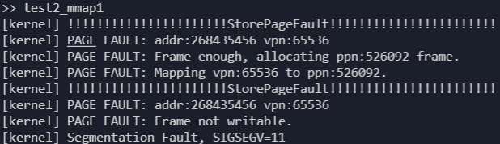
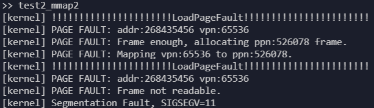
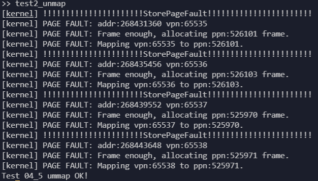

# 用户态程序测试

主要使用`mmap`和`munmap`两个系统调用进行测试。

## 初步测试

初步测试使用`ch4`中的测例进行测试，测试算法为 `FIFO` ，目的为检验页面置换机制的正确性，结果如下：

首先可以看到操作系统启动后可以使用的物理页面数量为454：

<div align=center>


</div>

对于`test2_mmap0`，将其中len设置得较大，使得其分配的内存大于操作系统可以使用得总的物理页面内存，就可以触发物理页面的换入和换出：

```rust
#[no_mangle]
fn main() -> i32 {
    let start: usize = 0x10000000;
    let len: usize = 4096 * 100;
    let prot: usize = 3;
    assert_eq!(0, mmap(start, len, prot));
    for i in start..(start + len) {
        let addr: *mut u8 = i as *mut u8;
        unsafe {
            *addr = i as u8;
        }
    }
    for i in start..(start + len) {
        let addr: *mut u8 = i as *mut u8;
        unsafe {
            assert_eq!(*addr, i as u8);
        }
    }
    println!("Test 04_1 OK!");
    0
}
```

将其设置为`4096 * 100`，即需要100个物理页面，此时操作系统可用的物理页面足够，只触发`StorePageFault`并通过测试：

<div align=center>



</div>

将其设置为`4096 * 800`，即需要800个物理页面，此时操作系统可用的物理页面不足，需要换入和换出物理页面，会触发`StorePageFault`和`LoadPageFault`，并通过测试：

<div align=center>


</div>

对于`test2_mmap1`，程序分配了只读的一个物理页面的内存后，尝试修改内存：

```rust
#[no_mangle]
fn main() -> i32 {
    let start: usize = 0x10000000;
    let len: usize = 4096;
    let prot: usize = 1;
    assert_eq!(0, mmap(start, len, prot));
    let addr: *mut u8 = start as *mut u8;
    unsafe {
        *addr = start as u8;
    }
    println!("Should cause error, Test 04_2 fail!");
    0
}
```

结果如下，先触发缺页异常分配一个物理页面，然后同一条指令再次触发缺页异常，被判断为修改不可写的物理页面结束进程:

<div align=center>



</div>

对于`test2_mmap2`，程序分配了只写的一个物理页面的内存后，尝试访问内存：

```rust
#[no_mangle]
fn main() -> i32 {
    let start: usize = 0x10000000;
    let len: usize = 4096;
    let prot: usize = 2;
    assert_eq!(0, mmap(start, len, prot));
    let addr: *mut u8 = start as *mut u8;
    unsafe {
        // *addr = start as u8; // can't write, R == 0 && W == 1 is illegal in riscv
        assert!(*addr != 0);
    }
    println!("Should cause error, Test 04_2 fail!");
    0
}
```

结果如下，先触发缺页异常分配一个物理页面，然后同一条指令再次触发缺页异常，被判断为读取不可读的物理页面结束进程:

<div align=center>



</div>

对于`test2_unmap`，其用来测试`mmap`和`munmap`的正确性，也可以测试缺页异常处理的正确性：

```rust
#[no_mangle]
fn main() -> i32 {
    let start: usize = 0x10000000;
    let len: usize = 4096;
    let prot: usize = 3;
    assert_eq!(0, mmap(start, len, prot));
    assert_eq!(mmap(start + len, len * 2, prot), 0);
    assert_eq!(munmap(start, len), 0);
    assert_eq!(mmap(start - len, len + 1, prot), 0);
    // println!("~~~~~~");
    for i in (start - len)..(start + len * 3) {
        let addr: *mut u8 = i as *mut u8;
        unsafe {
            *addr = i as u8;
        }
    }
    for i in (start - len)..(start + len * 3) {
        let addr: *mut u8 = i as *mut u8;
        unsafe {
            assert_eq!(*addr, i as u8);
        }
    }
    println!("Test 04_5 ummap OK!");
    0
}
```

结果如下，触发四次缺页异常并分配物理页面通过测试：

<div align=center>



</div>

## 综合测试结果

综合测试共七个测例，分别对每个算法进行测试，目的为检验算法正确性以及测试各个算法的效率。

* 测例一

  ```rust
  fn main() -> i32 {
    let start: usize = 0x10000000;
    let len: usize = 4096 * 100;
    let prot: usize = 3;
    assert_eq!(0, mmap(start, len, prot));
    for i in start..(start + len) {
        let addr: *mut u8 = i as *mut u8;
        unsafe {
            *addr = i as u8;
        }
    }
    for i in start..(start + len) {
        let addr: *mut u8 = i as *mut u8;
        unsafe {
            assert_eq!(*addr, i as u8);
        }
    }
    println!("Test1 OK!");
    0
  }
  ```
  
  此测例为基础测例，依顺序访问申请的内存地址，其申请的页面不超过用户可用的物理页面，也即所有页面可同时存放在内存中。
* 测例二

  ```rust
  fn main() -> i32 {
    let start: usize = 0x10000000;
    let len: usize = 4096 * 400;
    let prot: usize = 3;
    assert_eq!(0, mmap(start, len, prot));
    for i in start..(start + len) {
        let addr: *mut u8 = i as *mut u8;
        unsafe {
            *addr = i as u8;
        }
    }
    for i in start..(start + len) {
        let addr: *mut u8 = i as *mut u8;
        unsafe {
            assert_eq!(*addr, i as u8);
        }
    }
    println!("Test2 OK!");
    0
  }
  ```

  此测例和测例一基本相同，但申请的页面若再算上申请页表用去的页面超过了用户可用的物理页面，测试算法是否能正常运行并且通过测试。
* 测例三

  ```rust
  fn main() -> i32 {
    let start: usize = 0x10000000;
    let len: usize = 4096 * 100;
    let prot: usize = 3;
    let seed: isize = get_time();
    let mut v: isize = seed;
    assert_eq!(0, mmap(start, len, prot));
    for i in 0..len {
        let mut k = i as isize + random(4096, v);
        while k<0 || k>=len as isize {
            k = i as isize + random(4096, k);
        }
        let addr: *mut u8 = (start + k as usize) as *mut u8;
        unsafe {
            *addr = (k as usize) as u8;
        }
        v = k;
    }

    let mut v: isize = seed;
    for i in 0..len {
        let mut k = i as isize + random(4096, v);
        while k<0 || k>=len as isize {
            k = i as isize + random(4096, k);
        }
        let addr: *mut u8 = (start + k as usize) as *mut u8;
        unsafe {
            assert_eq!(*addr, (k as usize) as u8);
        }
        v = k;
    }
    println!("Test3 OK!");
    0
  }
  ```

  此测例用了我自己写的伪随机函数 `pub fn random(m: isize, last: isize)`，生成 `[-m, m)` 区间内的整数，`last` 为上一个随机数。
  此测例与测例一相似，大致依顺序访存，但每次访存时加上一个 `[-4096, 4096)` 的随机数。
* 测例四
  
  ```rust
  fn main() -> i32 {
    let start: usize = 0x10000000;
    let len: usize = 4096 * 400;
    let prot: usize = 3;
    let seed: usize = get_time() as usize;
    let mut v: usize = seed;
    assert_eq!(0, mmap(start, len, prot));
    for _ in 0..4096 {
        let k = random(len, v);
        let addr: *mut u8 = (start + k) as *mut u8;
        unsafe {
            *addr = (k) as u8;
        }
        v = k;
    }

    let mut v: usize = seed;
    for _ in 0..4096 {
        let k = random(len, v);
        let addr: *mut u8 = (start + k as usize) as *mut u8;
        unsafe {
            assert_eq!(*addr, (k as usize) as u8);
        }
        v = k;
    }
    println!("Test4 OK!");
    0
  }
  ```

  此测例用的伪随机函数 `pub fn random(m: isize, last: isize)` 稍有不同，生成的是 `[0, m)` 区间的整数，测例进行了 4096 次整个申请内存上的随机访存并检验正确性。
* 测例五
  
  ```rust
  fn main() -> i32 {
    let start: usize = 0x10000000;
    let len: usize = 4096 * 400;
    let prot: usize = 3;
    let seed: usize = get_time() as usize;
    let mut v: usize = seed;
    assert_eq!(0, mmap(start, len, prot));
    for i in 0..64 {
        for _j in 0..64 {
            let k = random(len / 64, v) + len / 64 * i;
            let addr: *mut u8 = (start + k) as *mut u8;
            unsafe {
                *addr = (k) as u8;
            }
            v = k;
        }
    }

    let mut v: usize = seed;
    for i in 0..64 {
        for _j in 0..64 {
            let k = random(len / 64, v) + len / 64 * i;
            let addr: *mut u8 = (start + k as usize) as *mut u8;
            unsafe {
                assert_eq!(*addr, (k as usize) as u8);
            }
            v = k;
        }
    }
    println!("Test5 OK!");
    0
  }
  ```

  此测例与测例四相似，但将 4096 次访存分成 64 轮，将申请的内存也平均分成 64 块，每轮访问的内存为申请内存的其中一块，在这一块中进行随机访存，以模拟计算机程序的局部性，在测试结果中可以看见缺页异常的次数相较于测例四有显著下降。
* 测例六

  ```rust
  fn main() -> i32 {
    for i in 0..3 {
        let pid = fork();
        if pid == 0 {
            println!("I am child {}", i);
            let start: usize = 0x10000000;
            let len: usize = 4096 * 400;
            let prot: usize = 3;
            let seed: usize = get_time() as usize;
            let mut v: usize = seed;
            assert_eq!(0, mmap(start, len, prot));
            for i in 0..64 {
                for _j in 0..64 {
                    let k = random(len / 64, v) + len / 64 * i;
                    let addr: *mut u8 = (start + k) as *mut u8;
                    unsafe {
                        *addr = (k) as u8;
                    }
                    v = k;
                }
            }
        
            let mut v: usize = seed;
            for i in 0..64 {
                for _j in 0..64 {
                    let k = random(len / 64, v) + len / 64 * i;
                    let addr: *mut u8 = (start + k as usize) as *mut u8;
                    unsafe {
                        assert_eq!(*addr, (k as usize) as u8);
                    }
                    v = k;
                }
            }
            exit(0);
        } else {
            println!("forked child pid = {}", pid);
        }
        assert!(pid > 0);
    }
    let mut exit_code: i32 = 0;
    for _ in 0..3 {
        if wait(&mut exit_code) <= 0 {
            panic!("wait stopped early");
        }
    }
    if wait(&mut exit_code) > 0 {
        panic!("wait got too many");
    }
    println!("Test6 OK!");
    0
  }
  ```

  此测例 `fork` 了三个子进程，每个子进程都进行测例五的测试。
* 测例七

  ```rust
  fn main() -> i32 {
    for i in 0..3 {
        let pid = fork();
        if pid == 0 {
            println!("I am child {}", i);
            if i == 0 {
                let start: usize = 0x10000000;
                let len: usize = 4096 * 400;
                let prot: usize = 3;
                let seed: usize = get_time() as usize;
                let mut v: usize = seed;
                assert_eq!(0, mmap(start, len, prot));
                for i in 0..64 {
                    for _j in 0..64 {
                        let k = random(len / 64, v) + len / 64 * i;
                        let addr: *mut u8 = (start + k) as *mut u8;
                        unsafe {
                            *addr = (k) as u8;
                        }
                        v = k;
                    }
                }
            
                let mut v: usize = seed;
                for i in 0..64 {
                    for _j in 0..64 {
                        let k = random(len / 64, v) + len / 64 * i;
                        let addr: *mut u8 = (start + k as usize) as *mut u8;
                        unsafe {
                            assert_eq!(*addr, (k as usize) as u8);
                        }
                        v = k;
                    }
                }
            }
            if i == 1 {
                let start: usize = 0x10000000;
                let len: usize = 4096 * 400;
                let prot: usize = 3;
                let seed: usize = get_time() as usize;
                let mut v: usize = seed;
                assert_eq!(0, mmap(start, len, prot));
                for _ in 0..4096 {
                    let k = random(len, v);
                    let addr: *mut u8 = (start + k) as *mut u8;
                    unsafe {
                        *addr = (k) as u8;
                    }
                    v = k;
                }
            
                let mut v: usize = seed;
                for _ in 0..4096 {
                    let k = random(len, v);
                    let addr: *mut u8 = (start + k as usize) as *mut u8;
                    unsafe {
                        assert_eq!(*addr, (k as usize) as u8);
                    }
                    v = k;
                }
            }
            if i == 2 {
                let start: usize = 0x10000000;
                let len: usize = 4096 * 400;
                let prot: usize = 3;
                assert_eq!(0, mmap(start, len, prot));
                for i in start..(start + len) {
                    let addr: *mut u8 = i as *mut u8;
                    unsafe {
                        *addr = i as u8;
                    }
                }
                for i in start..(start + len) {
                    let addr: *mut u8 = i as *mut u8;
                    unsafe {
                        assert_eq!(*addr, i as u8);
                    }
                }
            }
            exit(0);
        } else {
            println!("forked child pid = {}", pid);
        }
        assert!(pid > 0);
    }
    let mut exit_code: i32 = 0;
    for _ in 0..3 {
        if wait(&mut exit_code) <= 0 {
            panic!("wait stopped early");
        }
    }
    if wait(&mut exit_code) > 0 {
        panic!("wait got too many");
    }
    println!("Test7 OK!");
    0
  }
  ```

  此测例 `fork` 了三个子进程，分别进行测例二、四、五的测试。

### FIFO算法


